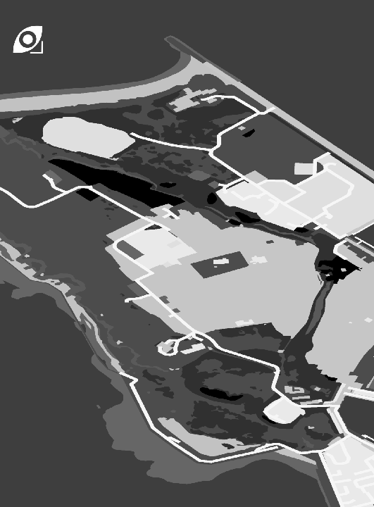
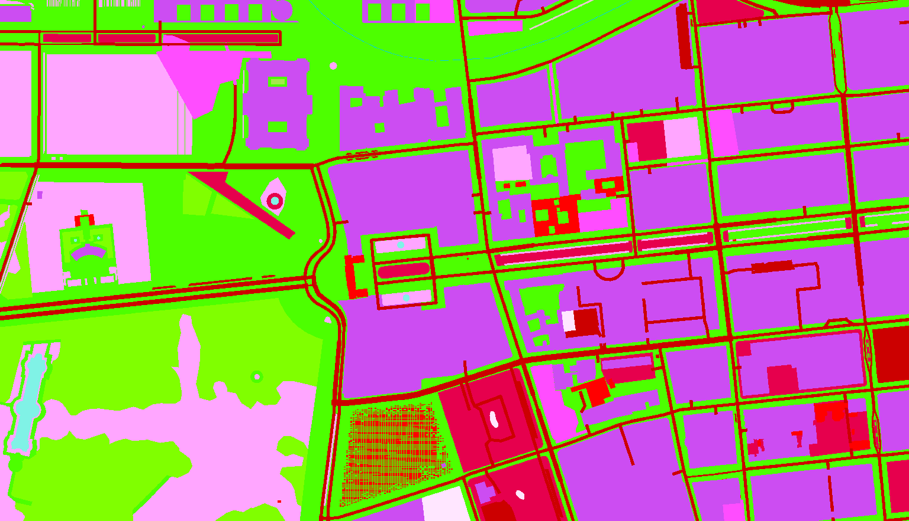
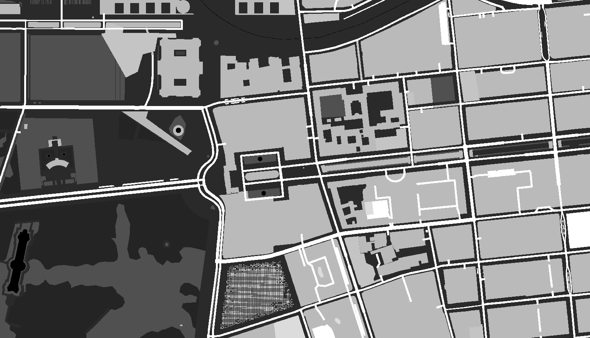

# LRLULC - Locally rendered land use/land cover images from OpenStreetMap data #

OpenStreetMap LULC image for Virtual Battlespace 4 (VBS4)
    

    

    

VBS4 landscape rendered from LULC image

    

LULC map derived from: OpenStreetMap 2025, [openstreetmap.org/copyright]( openstreetmap.org/copyright), © [ESA WorldCover project](https://esa-worldcover.org/en) 2021 / Contains modified Copernicus Sentinel data (2021) processed by ESA WorldCover consortium

This repository hosts the static data sets, scripts and binaries needed to create geographically referenced land use/land cover (LULC) bitmaps from OpenStreetMap vector maps as described in the following paper.

(paper link will be added after publication on or after April 5th, 2025)

Please cite the above paper if you use any of the tools provided by this repository in a scientific context. 

## 1. Licenses ##

> 
 
> Important note:   
>     Any LULC images you render from OpenStreetMap (OSM) data and the vectorized world cover layer provided by this repository must give proper credit to OpenStreetMap and ESA WorldCover according to their attribution requirements when being published, e.g., on a website or as a part of a scientific paper.
 

 A possible attribution could look like this:

"LULC map derived from: OpenStreetMap [year of OSM dataset used], [openstreetmap.org/copyright](openstreetmap.org/copyright), © [ESA WorldCover project](https://esa-worldcover.org/en) 2021 / Contains modified Copernicus Sentinel data (2021) processed by ESA WorldCover consortium"

 

* The contents of the *scripts* directory to create the GeoPackages and render LULC maps as described in the paper are free software under the [GNU Affero General Public License version 3](https://www.gnu.org/licenses/agpl-3.0.en.html). An exception is the *osmconf_lulc.ini* file , which comes under  [the same MIT-style license as GDAL/OGR](https://gdal.org/en/stable/license.html) since it was derived from their *osmconf.ini*.

* The names "OpenStreetMap", "OSM" and related wordmarks are a trademark of the [OpenStreetMap Foundation](https://osmfoundation.org). Neither the author(s) nor [DLR](https://www.dlr.de/en) are  endorsed by or affiliated with the OpenStreetMap Foundation.

* High detail vector data is taken from [OpenStreetMap](https://www.openstreetmap.org), [openstreetmap.org/copyright]( openstreetmap.org/copyright).

* The vectorized [WorldCover 2021](https://worldcover2021.esa.int/) base layer is *© ESA WorldCover project / Contains modified Copernicus Sentinel data (2021) processed by ESA WorldCover consortium*, but released under a [CC-BY](https://creativecommons.org/licenses/by/4.0) license. Please refer to their website and the following publication for technical details:

  *Zanaga, D., Van De Kerchove, R., Daems, D., De Keersmaecker, W., Brockmann, C., Kirches, G., Wevers, J., Cartus, O., Santoro, M., Fritz, S., Lesiv, M., Herold, M., Tsendbazar, N.E., Xu, P., Ramoino, F., Arino, O., 2022. ESA WorldCover 10 m 2021 v200.* https://doi.org/10.5281/zenodo.7254221

* [Mapnik](https://mapnik.org/) is a [free software](http://www.gnu.org/philosophy/free-sw.html) and is released under [LGPL](http://www.gnu.org/licenses/old-licenses/lgpl-2.1.txt) (GNU Lesser General Public Licence v2.1). Licenses of its dependencies are listed in the LICENSES file next to the binaries. 

  

## 2. Software Prerequisites ##

Before you can start producing your own LULC images, the repository needs to be cloned. The following software tools must be installed on the computer and accessible from the command line:

* [GDAL/OGR](https://gdal.org/en/stable/) 3.9+ (the GDAL/OGR Python utilities will not be needed)
* [PROJ](https://proj.org/en/stable/) 9+
* [Python](https://www.python.org/downloads/) 3.11+
* mapnik-render 4.0+ from [Mapnik](https://mapnik.org/) (a static Windows binary is provided through this repository)

Under Windows, the easiest way to fulfill these prerequisites except for mapnik-render is the installation of [OSGeo4W](https://trac.osgeo.org/osgeo4w), for which there is [network installer](https://download.osgeo.org/osgeo4w/v2/osgeo4w-setup.exe). After the installation, the OSGeo4W shell will be available from the start menu and provide you with a working command line environment. 

The missing mapnik-render tool is provided as a zip archive in the *tools* subdirectory of this repository to which the contained executable must be unpacked. The statically linked executable will work on 64-bit Windows installations and integrates all I/O plugins and dependencies, hence the size of ~86 MiB.

Under Linux, the distribution of your choice normally provides the above software through the package manager. For RHEL/Fedora, you can install the prerequisites with

`yum install gdal mapnik-utils`

Then add the following variables to your *.bash_profile* file (assuming  *bash* is the standard shell) and log in again to establish a working environment:

`export GDAL_DATA=/usr/share/gdal`

`export PROJ_PATH=/usr/share/proj`

The Linux binary of mapnik-render typically comes with dynamically linked I/O plugins stored in a specific location. This location will be needed for rendering and therefore must be determined first. Under RHEL/Fedora, the mapnik-render I/O plugin path normally is

`/usr/lib64/mapnik/input`

Any of the above paths mentioned may be different on other Linux distributions and shells though. 

Finally, to check if everything works, open the OSGeo4W shell under Windows or a terminal window under Linux and enter the following commands:

`gdal_translate --version`

`ogr2ogr --version`

You should see the version number of these tools, which must  equal or exceed 3.9. To validate if PROJ is correctly working and supports [EPSG codes](https://epsg.io) as coordinate system descriptions for reprojection, in the OSGeo4W shell or Linux shell, just type:

`echo 52N 13E | cs2cs EPSG:4326 EPSG:32633`

You should see the following output:

`362705.63       5762926.81 0.00`

If there is a different output, please verify that OSGeo4W has been installed in full on Windows. Under Linux, please check if the PROJ_DATA environment variable has been set and whether it points to the directory containing the file *proj.db*.

## 3. Global Dataset Installation ##

Aside from the software prerequisites, the global base layer and water polygon data sets need to be downloaded once and placed in the *baselayer* and *waterpolygons* folders of the cloned repository. Due to their size, these vector data sets are hosted externally.

### 3.1. Base Layer Dataset ###

Data from the specifically prepared base layer will be used to fill landside gaps in the OpenStreetMap data. It can be retrieved in two resolutions.

High-resolution version, 0.0025° per pixel, ~278 m/pixels (691 MiB):

[ESA_WorldCover_2021_v200__0_0025deg_ip.gpkg.zip](http://science.csidev.net/data/worldcover/ESA_WorldCover_2021_v200__0_0025deg_ip.gpkg.zip)

Low-resolution version, 0.01° per pixel, ~1113 m/pixels (131 MiB):

[ESA_WorldCover_2021_v200__0_01deg_ip.gpkg.zip](http://science.csidev.net/data/worldcover/ESA_WorldCover_2021_v200__0_01deg_ip.gpkg.zip)

Download at least one of these and place them into the *baselayer* subdirectory. Both GeoPackages are [SOZip](https://github.com/sozip/sozip-spec)-compressed and don't have to be unpacked.

### 3.2. Water Polygon Dataset ###

The consolidated OpenStreetMap water polygons are used to shape large water surfaces which have not been consistently modeled in the OpenStreetMap database. The original dataset that was used to create the SO-Zipped GeoPackage for LULC rendering can be found [here](https://osmdata.openstreetmap.de/data/water-polygons.html).

Download the file from the link below and place it as-is into the *waterpolygons* subdirectory of the repository. There is no need for unpacking.

[water_polygons_osmenc.gpkg.zip](http://science.csidev.net/data/waterpolygons/water_polygons_osmenc.gpkg.zip)

## 4. How to render land cover on your PC ##

With a working environment and the global datasets installed, LULC images of an arbitrary target area can now be rendered.  In the following, we'll be assuming Windows conventions here. Linux users must use forward slashes as path delimiters. 

1. Download an OSM serialization (*.osm.pbf* file) of the area the LULC scene to be rendered is a part of. The necessary inputs can be retrieved e.g. from [GeoFabrik](https://download.geofabrik.de/) for almost any part of the world. For example, if you want to render LULC data of cities in Germany, download the *.osm.pbf* file for Germany. Place the serialization in the *areas* subdirectory of the cloned repository.

2. Open an OSGeo4W shell/Linux shell and change to the directory of the repository with the `cd` command.

3. Condense the semantically annotated vector data from the *.osm.pbf* file, WorldCover base layer and OSM water polygons into a [GeoPackage](https://www.geopackage.org/) file suitable for LULC rendering. This is achieved with the *osmToGpkg.py* Python script from the *scripts* folder. You can save space with SOZip compression enabled, i.e., give the GeoPackage output the .zip extension. 

   Assuming the OSM serialization you downloaded in step 1 is called *area.osm.pbf* and got placed in the *areas* subfolder, with the high-res base layer available in the *baselayer* directory, just type:

   `python scripts\osmToGpkg.py --osmconf scripts\osmconf_lulc.ini --waterlayer waterpolygons\water_polygons_osmenc.gpkg.zip --baselayer baselayer\ESA_WorldCover_2021_v200__0_0025deg_ip.gpkg.zip areas\area.osm.pbf output\area.gpkg.zip`

   Notes: 

   * To see all options available for *osmToGpkg.py*, run without arguments

   * Advanced users may further restrict the extent of the OSM serialization to a smaller area with the `--ogropts` option, which accepts any "reasonable" [ogr2ogr arguments](https://gdal.org/en/stable/programs/ogr2ogr.html) including `-clipsrc [<xmin> <ymin> <xmax> <ymax>`]. Any *ogr2ogr* options should be placed in parentheses  following `--ogropts` though.

4. Now render the scene of your choice at the desired resolution as a LULC image in [GeoTIFF](https://www.ogc.org/publications/standard/geotiff/) format with the *renderLULC.py* Python script from the scripts folder. 

   For CORINE land cover (CLC) level 3 LULC maps, given the extent of the scene as a lon/lat pair that lies inside the extent of the OSM serialization and a metric output resolution (aka the ground sampling distance, or GSD, in meters per pixel), enter:

   `python scripts\renderLULC.py --mapnik-render tools\mapnik-render.exe --mapnik-style-sheet=scripts\lulc_corine.xml <lonMin> <latMin> <lonMax> <latMax> <gsdMetersPerPixel> output\area.gpkg.zip output\area.tif`

   Under Linux, you may have to additionally specify where the mapnik-render I/O plugins are located:

   `python scripts\renderLULC.py --mapnik-render mapnik-render --mapnik-plugins <path_to_plugins> --mapnik-style-sheet=scripts/lulc_corine.xml <lonMin> <latMin> <lonMax> <latMax> <gsdMetersPerPixel> output/area.gpkg.zip output/area.tif`

   This will yield the LULC image *area.tif* in the *output* subfolder.

   For [Virtual Battlespace 4](https://bisimulations.com/products/vbs4) (VBS4) land cover, replace `--mapnik-style-sheet=scripts\lulc_corine.xml` with `--mapnik-style-sheet=scripts\lulc_VBS4.xml`.  

5. Add proper attribution to your render results if you plan to publish them. Have a look at [ImageMagick](https://imagemagick.org/index.php) if you plan to do this in an automatic fashion.

   

## 5. Example ##

The render workflow outlined above is demonstrated for the sample *berlin-center.osm.pbf* OSM serialization from the *areas* subfolder to produce LULC images of the [Brandenburg Gate](https://en.wikipedia.org/wiki/Brandenburg_Gate) area of [Berlin](https://en.wikipedia.org/wiki/Berlin) in Germany. The extent of this very small serialization roughly is from 13.06°E 52.37°N to 13.78°E 52.66°N.

We could render a subset of this area as CORINE level 3 and VBS4 land cover rasters as follows:

1. Download the serialization. For the example, this has already been done, and *berlin-center.osm.pbf*  is readily available in the *areas* subfolder of the repository.

2. Open an OSGeo4W shell/Linux shell and change to the directory of the repository with the `cd` command.

3. Created the condensed GeoPackage assuming the high-res base layer got downloaded:

   `python scripts\osmToGpkg.py --osmconf scripts\osmconf_lulc.ini --waterlayer waterpolygons\water_polygons_osmenc.gpkg.zip --baselayer baselayer\ESA_WorldCover_2021_v200__0_0025deg_ip.gpkg.zip areas\berlin-center.osm.pbf output\berlin-center.gpkg.zip`

4. Render the scene to a GeoTIFF LULC image according to  the CORINE nomenclature. As the extent, we choose 13.374°E 52.513°N to 13.385°E 52.52°N, which lies inside the boundaries of the serialization. The target GSD shall be 0.5 m/pixel. The command to be entered therefore is:

   `python scripts\renderLULC.py --mapnik-render tools\mapnik-render.exe --mapnik-style-sheet=scripts\lulc_corine.xml 13.374 52.513 13.385 52.52 0.5 output\berlin-center.gpkg.zip output\berlin-center-bbgate.tif`

   Under RHEL/Fedora where the mapnik-render I/O plugins are stored under */usr/lib64/mapnik/input* and mapnik-render is available on the command line directly, please type instead:

   `python scripts/renderLULC.py --mapnik-render mapnik-render --mapnik-plugins /usr/lib64/mapnik/input --mapnik-style-sheet=scripts/lulc_corine.xml 13.37 52.513 13.39 52.52 0.5 output/berlin-center.gpkg.zip output/berlin-center-bbgate.tif`
   
    The output raster *output\berlin-center-bbgate.tif* should be 4453 x 2561 pixels and should look as shown here. Proper attribution has been added below the bitmap.

   

   LULC map derived from: OpenStreetMap 2025, [openstreetmap.org/copyright]( openstreetmap.org/copyright), © [ESA WorldCover project](https://esa-worldcover.org/en) 2021 / Contains modified Copernicus Sentinel data (2021) processed by ESA WorldCover consortium

    For a GeoTIFF bitmap according to the VBS4 nomenclature, the command on Windows is:
   
   `python scripts\renderLULC.py --mapnik-render tools\mapnik-render.exe --mapnik-style-sheet=scripts\lulc_VBS4.xml 13.374 52.513 13.385 52.52 0.5 output\berlin-center.gpkg.zip output\berlin-center-bbgate_VBS4.tif`
   
   On RHEL/Fedora with dynamically linked mapnik-render I/O plugins, type:
   
   `python scripts/renderLULC.py --mapnik-render mapnik-render --mapnik-plugins/usr/lib64/mapnik/input --mapnik-style-sheet=scripts/lulc_VBS4.xml 13.374 52.513 13.385 52.52 0.5 output/berlin-center.gpkg.zip output/berlin-center-bbgate_VBS4.tif`
   
   The VBS4 result *berlin-center-bbgate_VBS4.tif* of the same size as the CORINE LULC image should look like this (colors got normalized for display):
   
   
   
   LULC map derived from: OpenStreetMap 2025, [openstreetmap.org/copyright]( openstreetmap.org/copyright), © [ESA WorldCover project](https://esa-worldcover.org/en) 2021 / Contains modified Copernicus Sentinel data (2021) processed by ESA WorldCover consortium
   
   

## 6. Known Limitations

* The output LULC map shall not exceed 32768 x 32768 pixels. This is a mapnik-render limitation. To render larger LULC maps, subdivide the full output extent into (possibly overlapping) subtiles and render them separately. Then merge the tile, e.g., by using *gdal_merge.py* from GDAL/OGR using the nearest neighbor interpolation filter. This however requires the GDAL/OGR Python tools to be installed, which should be the case for OSGeo4W.
* You can use custom paths for the arguments of *osmToGpkg.py* and *renderLULC.py*, i.e., the global datasets, serializations etc. may be stored under directories outside the cloned repository. However, the contents of the *scripts* subfolder needs to be kept together in one directory and must not be split up.

